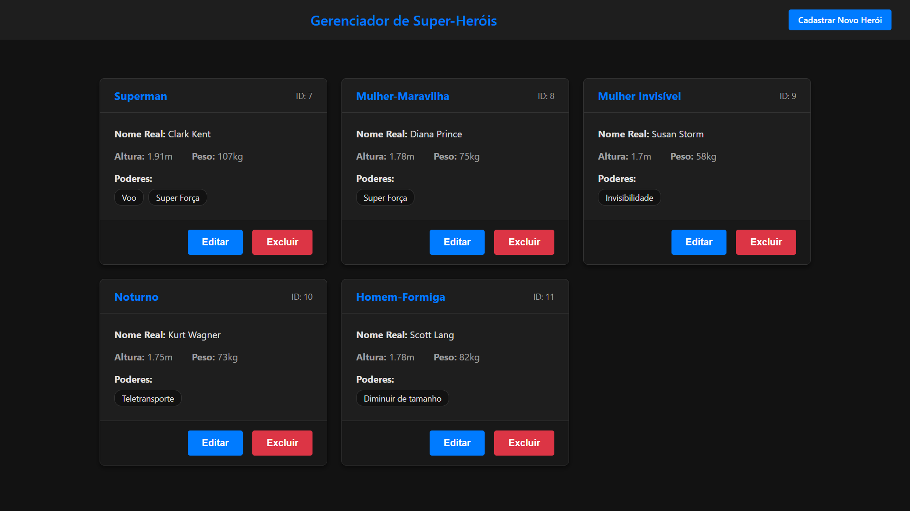

# Desafio Full Stack - Gerenciador de Super-Heróis

Projeto desenvolvido como solução para o desafio técnico da Viceri Seidor para a vaga de Desenvolvedor Full Stack Trainee. A aplicação consiste em um CRUD (Create, Read, Update, Delete) completo para gerenciar uma base de dados de super-heróis.




## ✨ Funcionalidades

* **Listagem de Heróis:** Visualização de todos os heróis cadastrados em um layout de cards responsivo.
* **Criação e Edição:** Formulário único para cadastrar novos heróis ou editar existentes.
* **Exclusão:** Funcionalidade para remover um herói da base de dados com diálogo de confirmação.
* **Validação de Regras de Negócio:** A API impede a criação de heróis com o mesmo nome de herói.

## 🚀 Tecnologias Utilizadas

Este projeto foi construído utilizando uma stack moderna e robusta, com separação clara entre o frontend e o backend.

**Backend (.NET 8)**
* **ASP.NET Core:** Para a construção da API RESTful.
* **Entity Framework Core:** ORM para interação com o banco de dados.
* **SQLite:** Banco de dados relacional leve e baseado em arquivo.
* **Padrão de DTOs (Data Transfer Objects):** Para garantir um contrato seguro e estável entre a API e o cliente.
* **Swagger:** Para documentação e teste interativo dos endpoints da API.

**Frontend (Angular 18)**
* **Angular Standalone Components:** Arquitetura moderna para componentes mais simples e reutilizáveis.
* **Reactive Forms:** Para a construção de formulários robustos e escaláveis.
* **TypeScript:** Para um código mais seguro e manutenível.
* **SCSS:** Para estilização avançada e organizada.
* **Arquitetura de Serviços:** Para centralizar a lógica de comunicação com a API.

## ⚙️ Como Executar o Projeto

Siga os passos abaixo para rodar a aplicação em seu ambiente local.

### Pré-requisitos
* [.NET SDK 8](https://dotnet.microsoft.com/download) ou superior.
* [Node.js e npm](https://nodejs.org/) (v18 ou superior).
* [Angular CLI](https://angular.io/cli) instalado globalmente (`npm install -g @angular/cli`).

### 1. Clonar o Repositório

Primeiro, clone o projeto do GitHub para a sua máquina local.

```bash
# Clone o repositório
git clone https://github.com/thiagofrdev/crud-herois-viceri.git

# Entre na pasta do projeto
cd crud-herois-viceri
```

### 2. Backend (API)

```bash
# 1. Navegue até a pasta do backend
cd backend

# 2. Restaure as dependências do .NET
dotnet restore

# 3. Aplique as migrations para criar o banco de dados SQLite
dotnet ef database update

# 4. Rode a aplicação
dotnet run
```
A API estará disponível em `http://localhost:5169` (ou na porta especificada no seu `launchSettings.json`).
Você pode acessar a documentação do Swagger em `http://localhost:5169/swagger`.

### 3. Frontend (Angular)

```bash
# 1. Em um novo terminal, navegue até a pasta do frontend
cd frontend

# 2. Instale as dependências do Node.js
npm install

# 3. Rode a aplicação de desenvolvimento
ng serve -o
```
A aplicação Angular será aberta automaticamente no seu navegador em `http://localhost:4200`.

## 🏛️ Arquitetura e Decisões Técnicas

* **Separação Backend/Frontend:** O projeto foi estruturado em duas pastas distintas para simular um ambiente de desenvolvimento real, onde as equipes de front e back trabalham de forma independente.
* **Uso de DTOs:** Foram criados DTOs para a entrada e saída de dados na API. Isso desacopla a camada de dados da camada de apresentação, previne referências circulares na serialização JSON e aumenta a segurança ao não expor as entidades do banco diretamente.
* **Componentização no Angular:** A interface foi dividida em "Smart Components" (páginas) e "Dumb Components" (componentes de UI reutilizáveis), como o `hero-card` e o `hero-form-ui`, seguindo as melhores práticas do Angular.
* **Conventional Commits:** O versionamento do código seguiu o padrão de Conventional Commits para manter um histórico de commits limpo e semântico.

---
_Projeto desenvolvido por Thiago F. Ribeiro como parte do processo seletivo da Viceri Seidor._
- GitHub: 
- LinkedIn: 